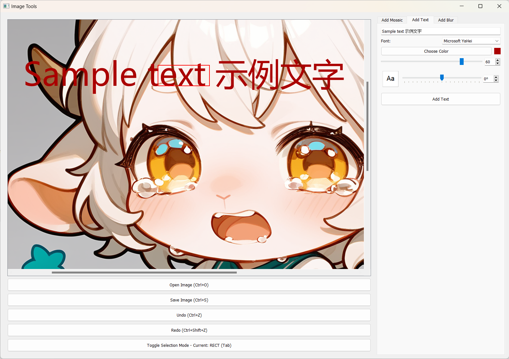
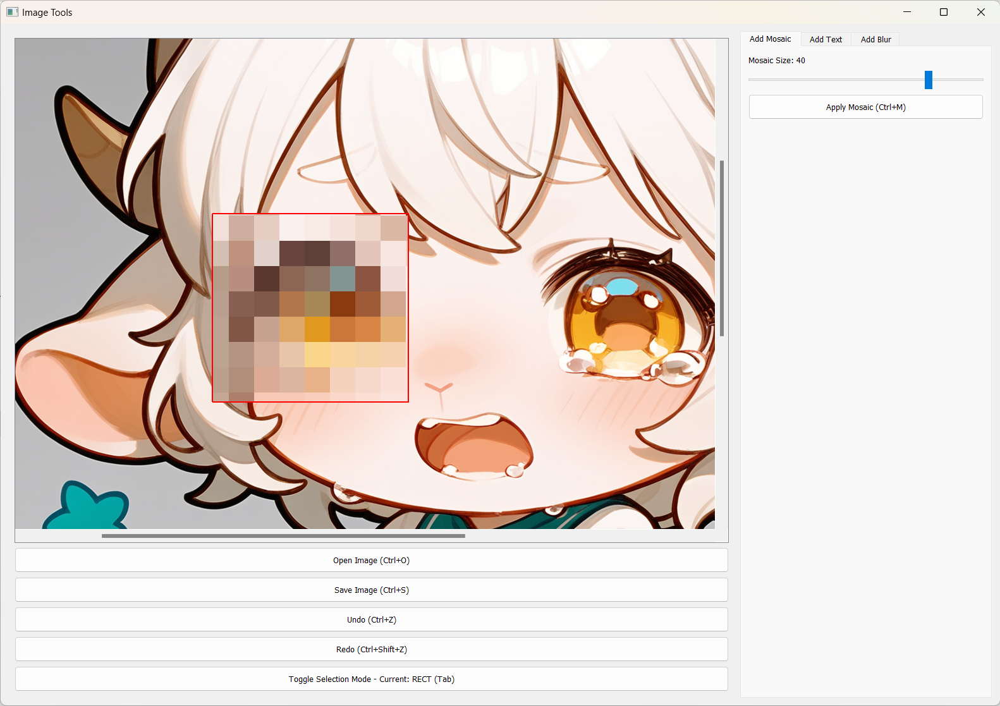
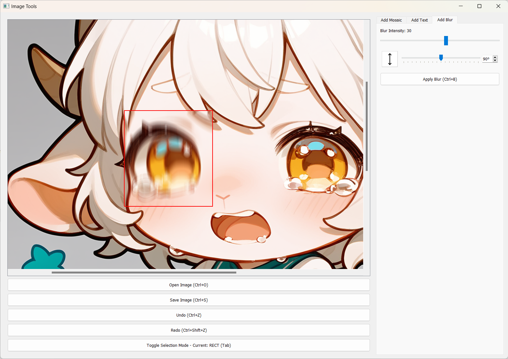

# Image Tools

A desktop application for basic image editing, including text overlay, mosaic and motion blur effects.

## Features & Examples

### Text Overlay
Add text with customizable font, size, color and rotation angle.



### Mosaic Effect
Apply mosaic effect to selected areas.



### Motion Blur
Create dynamic motion blur effects with adjustable intensity and angle.



## Other Features
- Image loading and saving
- Flexible rectangle and lasso selection tools
- Undo/Redo support
- Keyboard shortcuts

## Installation

1. Clone this repository:
   ```bash
   git clone https://github.com/xyz2357/image_tools.git
   cd image_tools
   ```

2. Install dependencies:
   ```bash
   pip install -r requirements.txt
   ```

## Usage

Run the main application:
```bash
run.bat
```

### Keyboard Shortcuts

- `Ctrl+O`: Open image
- `Ctrl+S`: Save image
- `Ctrl+Z`: Undo
- `Ctrl+Shift+Z`: Redo
- `Tab`: Toggle selection mode
- `Ctrl+T`: Apply text
- `Ctrl+M`: Apply mosaic
- `Ctrl+B`: Apply motion blur

## Development

### Running Tests
```bash
python -m unittest tests/ui/test_button_stability.py -v
```

### Project Structure
```plaintext
image_tools/
├── config/                  # Settings and configurations 
│   ├── __init__.py
│   └── settings.py         # Centralized settings management including shortcuts
│
├── ui/                     # User interface components
│   ├── __init__.py
│   ├── main_window.py     # Main application window
│   ├── text_widget.py     # Text overlay tool widget
│   ├── mosaic_widget.py   # Mosaic effect tool widget
│   ├── blur_widget.py     # Motion blur tool widget
│   └── image_and_selection_widget.py  # Image display and selection widget
│
├── utils/                  # Utility functions
│   ├── __init__.py
│   ├── image_utils.py     # Image processing utilities
│   └── shortcut_utils.py  # Keyboard shortcut utilities
│
├── tests/                  # Test files
│   ├── __init__.py
│   └── ui/
│       ├── __init__.py
│       └── test_button_stability.py  # UI stability tests
│
├── requirements.txt       # Project dependencies
├── run.bat               # Windows startup script
└── README.md            # Project documentation
```

## Contributing

Feel free to open issues or submit pull requests.

---

# Image Tools

一个用于基础图像编辑的桌面应用，支持添加文字、马赛克和运动模糊效果。

## 功能 & 示例

### 文字添加
添加文字，可自定义字体、大小、颜色和旋转角度。


### 马赛克效果
对选中的区域应用马赛克效果。


### 运动模糊
创建动态运动模糊效果，可调整强度和角度。


## 其他功能
- 图像加载和保存
- 灵活的矩形和套索选择工具
- 撤销/重做支持
- 键盘快捷键

## 安装

1. 克隆此仓库：
   ```bash
   git clone https://github.com/xyz2357/image_tools.git
   cd image_tools
   ```

2. 安装依赖：
   ```bash
   pip install -r requirements.txt
   ```

## 使用方法

运行主程序：
```bash
run.bat
```

### 键盘快捷键

- `Ctrl+O`: 打开图像
- `Ctrl+S`: 保存图像
- `Ctrl+Z`: 撤销
- `Ctrl+Shift+Z`: 重做
- `Tab`: 切换选择模式
- `Ctrl+T`: 添加文字
- `Ctrl+M`: 添加马赛克
- `Ctrl+B`: 添加运动模糊

## 开发

### 运行测试
```bash
python -m unittest tests/ui/test_button_stability.py -v
```

### 项目结构
```plaintext
image_tools/
├── config/                  # 设置和配置 
│   ├── __init__.py
│   └── settings.py         # 集中管理设置和快捷键
│
├── ui/                     # 用户界面组件
│   ├── __init__.py
│   ├── main_window.py     # 主程序窗口
│   ├── text_widget.py     # 文字工具组件
│   ├── mosaic_widget.py   # 马赛克工具组件
│   ├── blur_widget.py     # 运动模糊工具组件
│   └── image_and_selection_widget.py  # 图像显示和选择组件
│
├── utils/                  # 工具函数
│   ├── __init__.py
│   ├── image_utils.py     # 图像处理工具
│   └── shortcut_utils.py  # 快捷键工具
│
├── tests/                  # 测试文件
│   ├── __init__.py
│   └── ui/
│       ├── __init__.py
│       └── test_button_stability.py  # 界面稳定性测试
│
├── requirements.txt       # 项目依赖
├── run.bat               # Windows 启动脚本
└── README.md            # 项目文档
```

## 贡献

欢迎提出问题或提交代码改进。